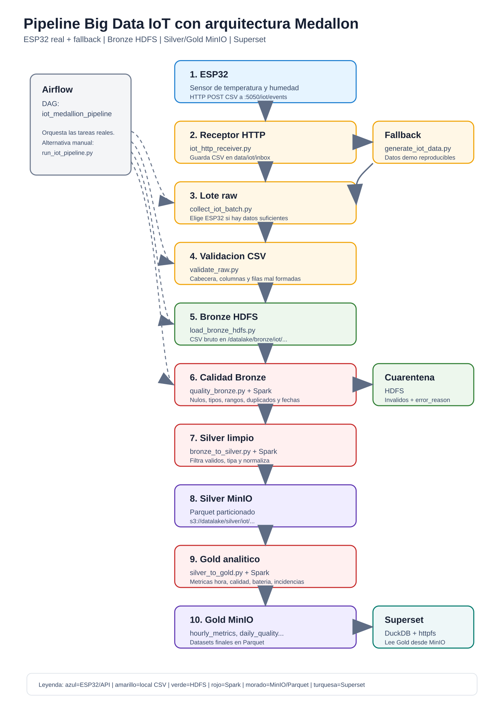

# Diagrama y ejecucion del pipeline IoT Medallon

## Diagrama general

El diagrama grande esta en un archivo SVG separado para poder abrirlo, ampliar el zoom e insertarlo en el PDF sin que quede diminuto:

[Abrir diagrama grande en SVG](./diagrama_pipeline_grande.svg)



Version resumida del flujo:

```text
ESP32
  -> iot-ingestor HTTP CSV
  -> data/iot/inbox
  -> collect_iot_batch.py
  -> data/iot/raw
  -> validate_raw.py
  -> HDFS Bronze
  -> quality_bronze.py
      -> HDFS Quarantine
      -> bronze_to_silver.py
  -> MinIO Silver Parquet
  -> validate_silver.py
  -> silver_to_gold.py
  -> MinIO Gold Parquet
  -> publish_gold_superset.py
  -> Superset con DuckDB
```

## Que hace cada fase

1. **Captura de datos ESP32**

   - La ESP32 mide temperatura y humedad.
   - Envia una linea CSV por HTTP POST a `http://<IP_DEL_PC>:5050/iot/events`.
   - El receptor `iot-ingestor` guarda las lecturas en `data/iot/inbox/esp32_events_YYYY-MM-DD.csv`.
2. **Preparacion del lote raw**

   - `collect_iot_batch.py` comprueba si hay suficientes datos reales de la ESP32.
   - Si hay al menos `--min-real-records`, usa esos datos reales.
   - Si no hay suficientes, genera un lote de respaldo con `source=simulator`.
   - El resultado queda en `data/iot/raw/run_date=YYYY-MM-DD/`.
3. **Validacion inicial del CSV**

   - `validate_raw.py` comprueba que el CSV tiene cabecera y columnas obligatorias.
   - No limpia datos todavia; solo asegura que el fichero se puede procesar.
   - Genera `data/iot/reports/run_date=YYYY-MM-DD/validate_raw_report.json`.
4. **Carga Bronze en HDFS**

   - `load_bronze_hdfs.py` sube el CSV tal cual a HDFS.
   - Ruta Bronze:
     `/datalake/bronze/iot/sensor_aula_01/year=YYYY/month=MM/day=DD/`
   - Esta capa conserva el dato bruto para poder reprocesarlo.
5. **Calidad y cuarentena**

   - `quality_bronze.py` usa Spark para leer Bronze.
   - Valida nulos, tipos, rangos, duplicados, fechas y estados.
   - Los registros invalidos van a cuarentena HDFS con `error_reason`.
   - Genera `quality_bronze_report.json` con totales de validos, invalidos, duplicados y errores.
6. **Silver en MinIO**

   - `bronze_to_silver.py` filtra solo registros validos.
   - Convierte columnas a tipos correctos.
   - Anade particiones temporales `year`, `month`, `day`, `hour`.
   - Guarda Parquet en MinIO:
     `s3://datalake/silver/iot/sensor_aula_01/events/`
7. **Validacion de Silver**

   - `validate_silver.py` comprueba que Silver existe, se puede leer y no contiene registros invalidos.
   - Genera `validate_silver_report.json`.
8. **Gold en MinIO**

   - `silver_to_gold.py` crea datasets analiticos:
     - `hourly_metrics`: medias, minimos, maximos y numero de eventos por hora.
     - `events_by_hour`: eventos por hora.
     - `daily_quality`: porcentaje de validos e invalidos.
     - `battery_hourly`: evolucion horaria de bateria.
     - `anomalies_by_type`: incidencias por tipo.
   - Guarda todos los datasets en Parquet dentro de `s3://datalake/gold/iot/sensor_aula_01/`.
9. **Publicacion para Superset**

   - `publish_gold_superset.py` genera SQL de consulta en `data/iot/superset/`.
   - Superset se conecta a MinIO con DuckDB y lee los Parquet de Gold directamente.

## Como ejecutar el entorno

Desde PowerShell, en la raiz del proyecto:

```bash
docker compose --profile core --profile orchestration --profile bi build
docker compose --profile core --profile batch --profile orchestration --profile bi up -d
```

Servicios principales:

- JupyterLab: `http://localhost:8888`
- Airflow: `http://localhost:8081`
- MinIO: `http://localhost:9001`
- Superset: `http://localhost:8089`
- HDFS Explorer: `http://localhost:9870`
- Receptor IoT: `http://localhost:5050/health`

## Como ejecutar el pipeline manual completo

Entrar en Jupyter:

```bash
docker exec -it jupyter-aula bash
```

Dentro del contenedor:

```bash
cd /home/jovyan/work
export PROJECT_ROOT=/home/jovyan/work
python src/jobs/run_iot_pipeline.py --date 2026-05-15 --min-real-records 10
```

El script ejecuta en orden:

```text
collect_iot_batch
validate_raw
load_bronze_hdfs
quality_bronze
bronze_to_silver
validate_silver
silver_to_gold
publish_gold_superset
```

Para reanudar desde una fase concreta:

```bash
python src/jobs/run_iot_pipeline.py --date 2026-05-15 --start-at quality_bronze
```

## Como ejecutar desde Airflow

1. Abrir `http://localhost:8081`.
2. Usuario: `admin`, password: `admin`.
3. Buscar el DAG `iot_medallion_pipeline`.
4. Activarlo.
5. Pulsar **Trigger DAG**.
6. Revisar que todas las tareas terminan en verde.

## Como probar la ingesta sin ESP32

Enviar una lectura manual en CSV:

```bash
curl -X POST http://localhost:5050/iot/events ^
  -H "Content-Type: text/csv" ^
  -d "manual_001,sensor_aula_01,2026-05-15T10:00:00,24.5,55.2,91,OK,esp32"
```

Verificar el fichero recibido:

```bash
type data\iot\inbox\esp32_events_2026-05-15.csv
```

## Como comprobar resultados

Bronze en HDFS:

```bash
docker exec -it jupyter-aula bash
hdfs dfs -ls /datalake/bronze/iot/sensor_aula_01/
```

Cuarentena en HDFS:

```bash
hdfs dfs -ls /datalake/quarantine/iot/sensor_aula_01/
```

Silver y Gold en MinIO:

1. Abrir `http://localhost:9001`.
2. Entrar con `admin / adminadmin`.
3. Abrir bucket `datalake`.
4. Revisar:
   - `silver/iot/sensor_aula_01/events/`
   - `gold/iot/sensor_aula_01/`

Informes de calidad:

```text
data/iot/reports/run_date=YYYY-MM-DD/
```

SQL para Superset:

```text
data/iot/superset/
```
